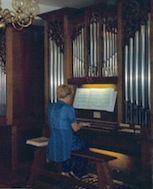

<link href="../../gc.css" rel="stylesheet" type="text/css">
# Jean Sebastien Bach
## Petits préludes et fugues
|   |Encore|MuseScore|PDF|MIDI|
|---|------|---------|---|----|
|Prelude BWV 928|[P928.enc](P928.ENC)||[P928.pdf](P928.PDF)|[P928.mid](P928.MID)|
|Prelude BWV 934|[P934.enc](P934.ENC)||[P934.pdf](P934.PDF)|[P934.mid](P934.MID)|
|Prelude BWV 936|[P936.enc](P936.ENC)||[P936.pdf](P936.PDF)|[P936.mid](P936.MID)|
|Prelude BWV 941|[P941.enc](P941.ENC)||[P941.pdf](P941.PDF)|[P941.mid](P941.MID)|
|Fugue BWV 902|[F902.enc](F902.ENC)||[F902.pdf](F902.PDF)|[F902.mid](F902.MID)|
|Fugue BWV 952|[F952.enc](F952.ENC)||[F952.pdf](F952.PDF)|[F952.mid](F952.MID)|
|Fugue BWV 961|[F961.enc](F961.ENC)||[F961.pdf](F961.PDF)|[F961.mid](F961.MID)|
## Le Clavier bien tempéré
### Prelude 24 BWV 869

|   |Encore|MuseScore|PDF|MIDI|
|---|------|---------|---|----|
|Full score|[P24.enc](P24.ENC)||[P24.pdf](P24.PDF)|[P24.mid](P24.MID)|
|Flute|[P24f.enc](P24F.ENC)||[P24f.pdf](P24F.PDF)|[P24f.mid](P24F.MID)|
|Hautbois|[P24o.enc](P24O.ENC)||[P24o.pdf](P24O.PDF)|[P24o.mid](P24O.MID)|
|Basse continue|[P24b.enc](P24B.ENC)||[P24b.pdf](P24B.PDF)|[P24b.mid](P24B.MID)|

### Fugues

|   |Encore|MuseScore|PDF|MIDI|
|---|------|---------|---|----|
|Fugue 1 BWV 846|[F1.enc](F1.ENC)||[F1.pdf](F1.PDF)|[F1.mid](F2.MID)|
|Fugue 2 BWV 847|[F2.enc](F2.ENC)||[F2.pdf](F2.PDF)|[F2.mid](F2.MID)|

## Chorals
### Nun komm der Heiden Heiland
|   |Encore|MuseScore|PDF|MIDI|
|---|------|---------|---|----|
|Full score|[C659.enc](C659.ENC)||[C659.pdf](C659.PDF)|[C659.mid](C659.MID)|
### Wachet auf, ruft uns die Stimme - Choral du veilleur
|   |Encore|MuseScore|PDF|MIDI|
|---|------|---------|---|----|
|Full score|[Wachet.enc](WACHET.ENC)||[Wachet.pdf](WACHET.PDF)|[Wachet.mid](WACHET.MID)|
|Flute|[Wachetf.enc](WACHETF.ENC)||[Wachetf.pdf](WACHETF.PDF)|[Wachetf.mid](WACHETF.MID)|
|Hautbois|[Wacheto.enc](WACHETO.ENC)||[Wacheto.pdf](WACHETO.PDF)|[Wacheto.mid](WACHETO.MID)|
|Clarinette|[Wachetc.enc](WACHETC.ENC)||[Wachetc.pdf](WACHETC.PDF)|[Wachetc.mid](WACHETC.MID)|
|Ogue|[Wachetp.enc](WACHETP.ENC)||[Wachetp.pdf](WACHETP.PDF)|[Wachetp.mid](WACHETP.MID)|
## Suites
### Suite BWV 1067
|Rondeau|Encore|MuseScore|PDF|MIDI|
|-------|------|---------|---|----|
|Full score|[S1067r.enc](S1067R.ENC)||[S1067r.pdf](S1067R.PDF)|[S1067r.mid](S1067R.MID)|
|Flute|[S1067rf.enc](S1067RF.ENC)||[S1067rf.pdf](S1067RF.PDF)|[S1067rf.mid](S1067RF.MID)|
|Recorder|[S1067rr.enc](S1067RR.ENC)||[S1067rr.pdf](S1067RR.PDF)|[S1067rr.mid](S1067RR.MID)|
|Hautbois|[S1067rh.enc](S1067RH.ENC)||[S1067rh.pdf](S1067RH.PDF)|[S1067rh.mid](S1067RH.MID)|
|Clarinette|[S1067rc.enc](S1067RC.ENC)||[S1067rc.pdf](S1067RC.PDF)|[S1067rc.mid](S1067RC.MID)|
|Clavecin|[S1067rp.enc](S1067RP.ENC)||[S1067rp.pdf](S1067RP.PDF)|[S1067rp.mid](S1067RP.MID)|

|Polonaise|Encore|MuseScore|PDF|MIDI|
|---|-----|---------|---|----|
|Full score|[S1067p.enc](S1067P.ENC)||[S1067p.pdf](S1067P.PDF)|[S1067p.mid](S1067P.MID)|
|Flute|[S1067pf.enc](S1067PF.ENC)||[S1067pf.pdf](S1067PF.PDF)|[S1067pf.mid](S1067PF.MID)|
|Recorder|[S1067pr.enc](S1067PR.ENC)||[S1067pr.pdf](S1067PR.PDF)|[S1067pr.mid](S1067PR.MID)|
|Hautbois|[S1067ph.enc](S1067PH.ENC)||[S1067ph.pdf](S1067PH.PDF)|[S1067ph.mid](S1067PH.MID)|
|Clarinette|[S1067pc.enc](S1067PC.ENC)||[S1067pc.pdf](S1067PC.PDF)|[S1067pc.mid](S1067PC.MID)|
|Clavecin|[S1067pp.enc](S1067PP.ENC)||[S1067pp.pdf](S1067PP.PDF)|[S1067pp.mid](S1067PP.MID)|

|Bourrée I|Encore|MuseScore|PDF|MIDI|
|---|-----|---------|---|----|
|Full score|[S1067b1.enc](S1067B1.ENC)||[S1067b1.pdf](S1067B1.PDF)|[S1067b1.mid](S1067B1.MID)|
|Flute|[S1067b1f.enc](S1067B1F.ENC)||[S1067B1f.pdf](S1067B1F.PDF)|[S1067b1f.mid](S1067B1F.MID)|
|Recorder|[S1067b1r.enc](S1067B1R.ENC)||[S1067b1r.pdf](S1067B1R.PDF)|[S1067b1r.mid](S1067B1R.MID)|
|Hautbois|[S1067b1h.enc](S1067B1H.ENC)||[S1067b1h.pdf](S1067B1H.PDF)|[S1067b1h.mid](S1067B1H.MID)|
|Clarinette|[S1067b1c.enc](S1067B1C.ENC)||[S1067b1c.pdf](S1067B1C.PDF)|[S1067b1c.mid](S1067B1C.MID)|
|Clavecin|[S1067b1p.enc](S1067B1P.ENC)||[S1067b1p.pdf](S1067B1P.PDF)|[S1067b1p.mid](S1067B1P.MID)|

