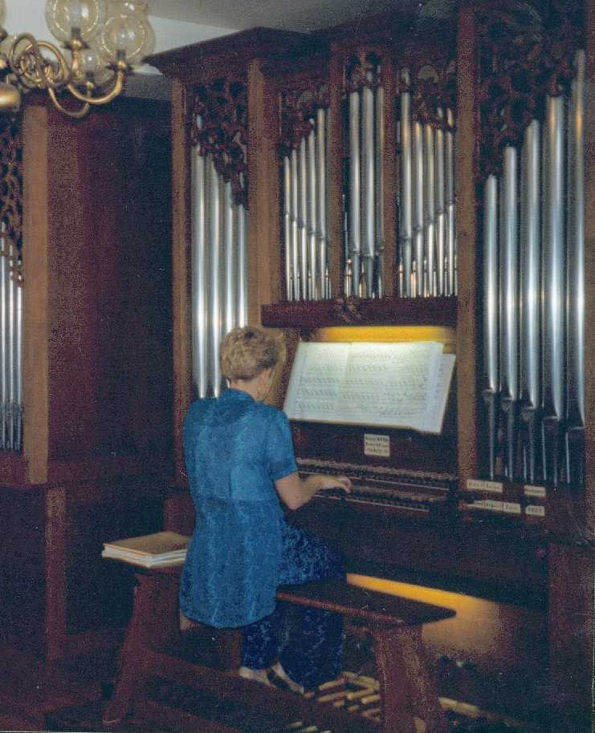

<link href="../../gc.css" rel="stylesheet" type="text/css">
# Jean Sebastien Bach
## Petits préludes et fugues
|   |Encore|MuseScore|PDF|MIDI|
|---|------|---------|---|----|
|Prelude BWV 928|[P928.enc](P928.ENC)||[P928.pdf](P928.PDF)|[P928.mid](P928.MID)|
|Prelude BWV 934|[P934.enc](P934.ENC)||[P934.pdf](P934.PDF)|[P934.mid](P934.MID)|
|Prelude BWV 936|[P936.enc](P936.ENC)||[P936.pdf](P936.PDF)|[P936.mid](P936.MID)|
|Prelude BWV 941|[P941.enc](P941.ENC)||[P941.pdf](P941.PDF)|[P941.mid](P941.MID)|
|Fugue BWV 902|[F902.enc](F902.ENC)||[F902.pdf](F902.PDF)|[F902.mid](F902.MID)|
|Fugue BWV 952|[F952.enc](F952.ENC)||[F952.pdf](F952.PDF)|[F952.mid](F952.MID)|
|Fugue BWV 961|[F961.enc](F961.ENC)||[F961.pdf](F961.PDF)|[F961.mid](F961.MID)|
